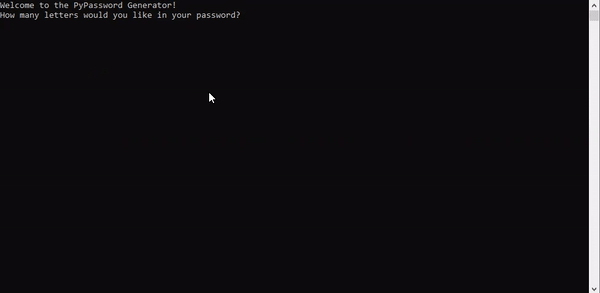

# Password Generator

Day 5 - Today, I learned about for loops in python. I then used this concept to make passsword generator.

The password generator code makes a password using a combination of symbols, letters and numbers.

