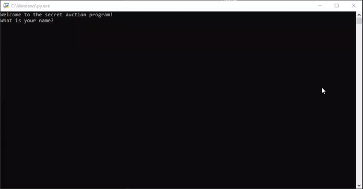

# Secret Auction Program

Day 9 - Today, I learned about Dictionaries and nesting. I used it to create a secret auction program.

It takes user's name and bid, compares it with other bidders and declares who wins!

