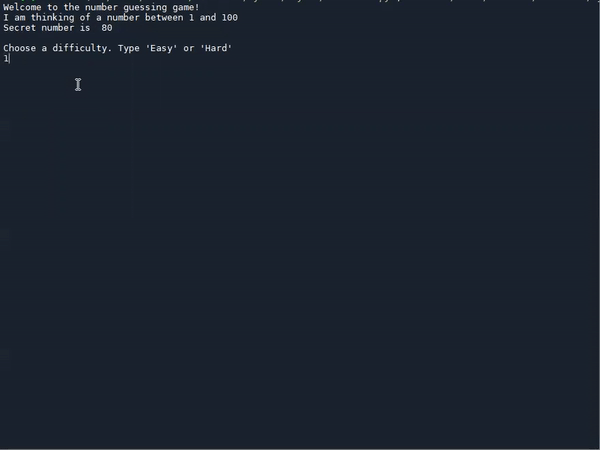

# Number Guessing Game

Day 12 - I learned about Constants, Local and Global scope. I also used these concepts to make a "Number Guessing" Game.

We need to guess a number between 1 and 100. The game tells us if our guess is higher or lower than the actual number. The game has two modes: Easy and Hard, Easy has 10 life and Hard has 2.

