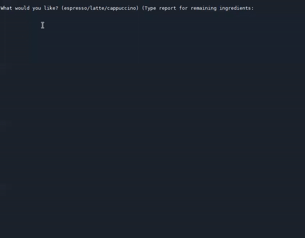

# Coffee Machine Project

Day 15 - I built a coffee machine project which asks user to select from 3 available coffee types. The porgram checks whether the machine has sufficient 
resources (milk/water/coffee) to prepare the drink and if user has enough money to pay for the drink.

